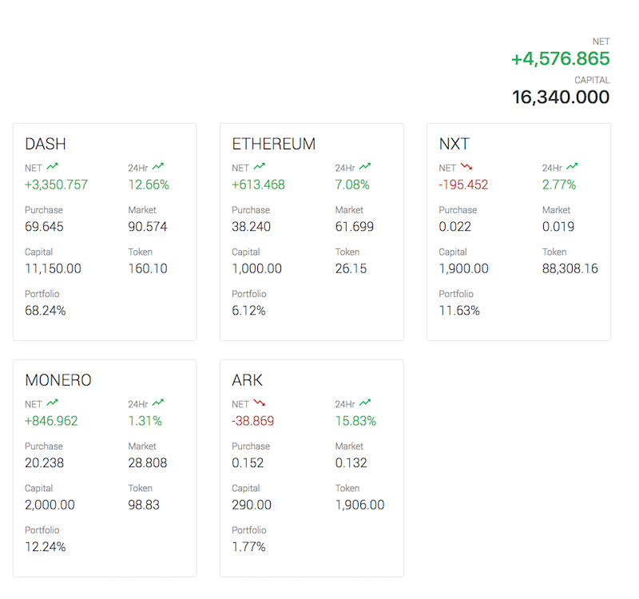

# Cryptoasset tracker dashboard

Basic dashboard to track investments on cryptoassets against market prices in [CoinMarketCap](http://coinmarketcap.com).

**Requirement**
- Meteor _(v1.4+)_
- OAuth 2.0 client credentials from the [Google API Console](https://console.developers.google.com/).

**Quickstart**
1. Clone repo and start meteor instance
```sh
$ git clone https://github.com/ermyas/crypto-dashboard.git
$ cd crypto-dashboard/
$ meteor
```
1. Navigate to <http://localhost:3000> to open the cryptoasset dashboard
1. Create a new OAuth 2.0 client credential from the [Google Developer Dashboard](https://console.developers.google.com/apis/dashboard), if you have not done so already.
2. On the Crytoasset dashboard, click on the *configure Google credentials* button and specify your OAuth credentials
3. Sign-in with your Google ID


