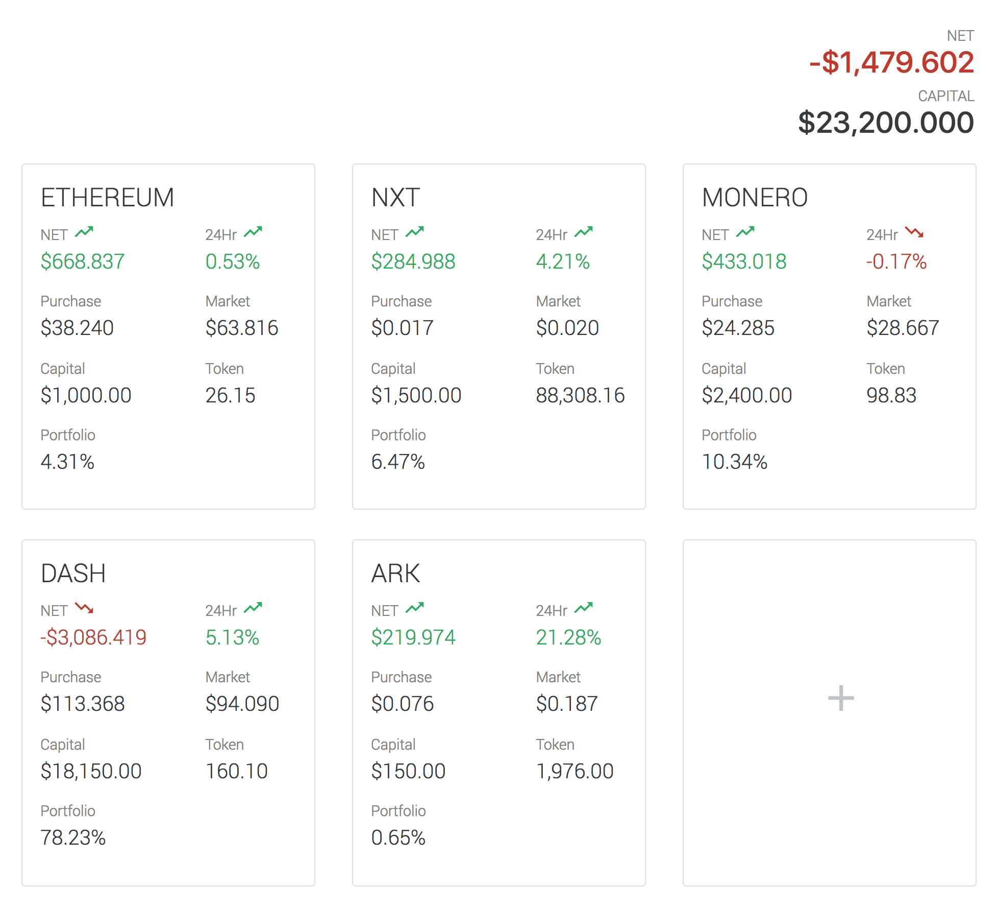

# Cryptocurrency dashboard

Basic dashboard to track investments on cryptocurrencies against realtime prices in [CoinMarketCap](http://coinmarketcap.com).

## Quickstart

### Requirement:

- Meteor _(version 1.4.x+)_

### Installation:

```sh
$ git clone https://github.com/ermyas/crypto-dashboard.git
$ cd crypto-dashboard/
$ meteor
# OR (to background task)
# nohup meteor &
```

### Getting started:
1. Navigate to http://localhost:300
1. Configure Google Developer account with a client id and client secret from Google Developer Console
1. Sign-in with your Google ID


